# Help name the VS Code pet

This little agent has reactions, opinions, and two excellent colorways. What it does not have is a name.

We are running a naming competition to fix that. Submit an original name in the competition thread, with an optional one-line reason it fits. The selected winner will receive **one month of Copilot Max**.

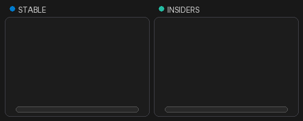

Every preview in this README shows the **Stable** and **Insiders** colors side by side.

## Meet the pet

- Type `/vscode-pet` to show or hide it.
- In the new-session view, use the checked **Pet (/vscode-pet)** context-menu item.
- Click it—or focus it with <kbd>Tab</kbd> and press <kbd>Enter</kbd> or <kbd>Space</kbd>—to get a reaction.
- Drag it around the composer, or use <kbd>←</kbd> and <kbd>→</kbd> while it is focused.
- Right-click it to change its size or let it go on the run.

## Everyday reactions

| Interaction | Preview |
| --- | --- |
| **Pointer tracking** Its pupils follow the pointer around the composer. | 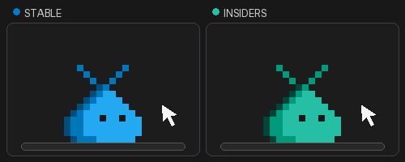 |
| **Typing** Give it a prompt and it gets to work at its tiny terminal. | 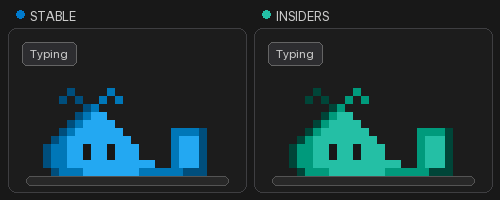 |
| **Processing** While a request is running, it thinks out loud. | 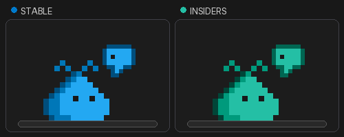 |
| **Needs input** Confirmations and questions earn an enthusiastic clap. | 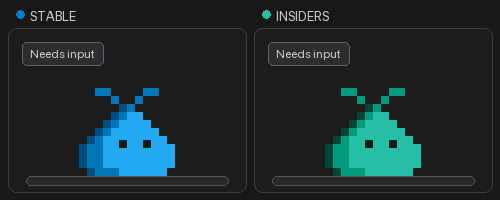 |
| **Sleep and wake** After 20 quiet seconds it falls asleep; interact with it or type to wake it. | 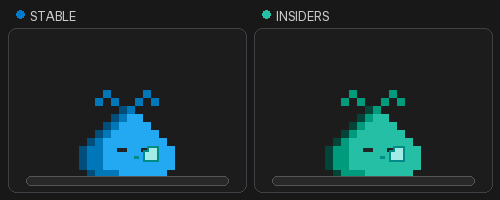 |

## Move it around

| Interaction | Preview |
| --- | --- |
| **Keyboard hop** Focus the pet and use the arrow keys to hop left or right. | 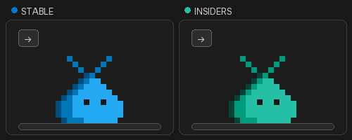 |
| **Drag and drop** Pick it up, move it across the composer, and drop it back on the input. | 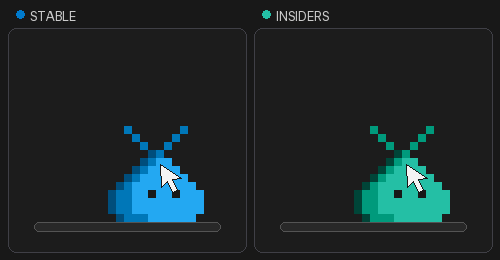 |
| **Fall and respawn** Drop it away from the input and it falls off, leaves a revive sign, respawns, and lands back on the composer. | 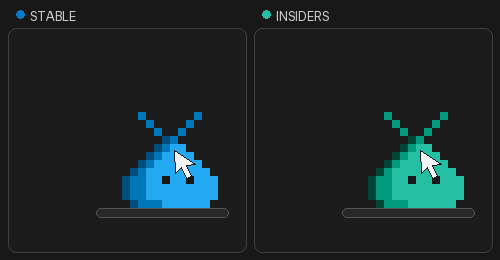 |

## Click surprises

A click chooses one of these reactions at random and avoids immediately repeating the last one. Finishing a response also triggers the button-press celebration.

| Reaction | Preview |
| --- | --- |
| **Button press** |  |
| **Heart!** | 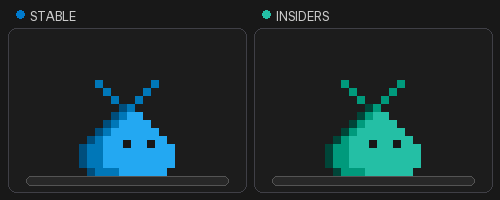 |
| **Cool.** |  |
| **VS Code** | 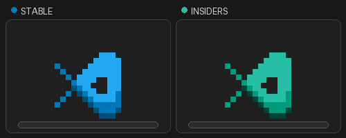 |
| **Sing** | 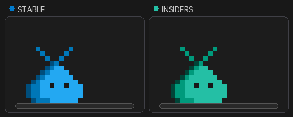 |
| **Speechless** |  |
| **Worry** |  |

## Context-menu actions

| Action | Preview |
| --- | --- |
| **Go on the Run / Come Back** It ducks out of sight, occasionally checks whether the coast is clear, and returns when called. | 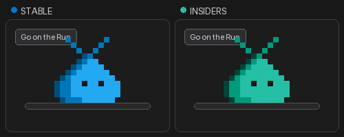 |
| **Grow / Shrink** Resize it in 20 percent steps down to 40 percent—or keep growing it. | 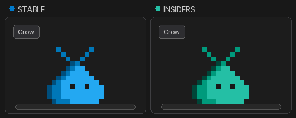 |

## License

The VS Code pet sprites and these derived previews are provided under the [MIT License](LICENSE).
